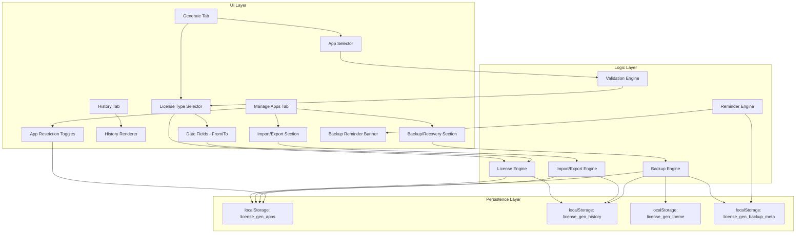

# Design Document: Date-Restricted License Keys

## Overview

This design extends the existing License Generator PWA with three major capabilities:

1. **Date-Restricted License Key Generation** — Adds time-bound licenses with "Valid From" and "Valid To" dates encoded into the HMAC-signed payload, while preserving full backward compatibility with existing perpetual keys.
2. **Granular Import/Export** — Enables selective export and import of the App Registry and License History as individual JSON files with metadata headers and merge-on-import semantics.
3. **Full Backup & Recovery** — Provides a single-file backup of all application state (registry, history, settings) with destructive restore, plus a configurable reminder system to encourage periodic backups.

All changes maintain the existing single-file vanilla JS architecture (no build tools, no bundler) and use localStorage for all persistence. The app remains a fully offline-capable PWA.

### Key Design Decisions

| Decision | Rationale |
|----------|-----------|
| Extend existing payload format rather than new key version | Simpler implementation; base64-decoded JSON is self-describing |
| Merge-on-import (not replace) for registry/history | Prevents accidental data loss; user can still do full restore |
| Single JSON file for full backup (not zip) | No external dependencies; human-readable; easy to validate |
| Reminder thresholds stored in localStorage | Consistent with existing persistence pattern |
| Per-app `restricted` flag in registry entries | Minimal schema change; backward-compatible with existing entries |

---

## Architecture

### High-Level Architecture



### Low-Level Module Architecture

The implementation remains in a single `app.js` file (no module bundler), organized as logical sections within the existing IIFE:

```
app.js
├── Theme Engine (existing)
├── Constants & Defaults (extended)
├── Registry Functions (extended with restricted flag)
├── HMAC / License Engine (extended with date payload)
├── Validation Engine (NEW)
├── History Manager (extended with date display)
├── Import/Export Engine (NEW)
├── Backup Engine (NEW)
├── Reminder Engine (NEW)
├── Tab Controller (existing)
├── History Renderer (extended)
├── DOM Ready / Event Binding (extended)
└── Service Worker Registration (existing)
```

---

## Components and Interfaces

### 1. License Engine (Extended)

**Responsibility:** Generate license keys for both perpetual and date-restricted types.

```javascript
// Existing function signature remains unchanged for perpetual keys:
async function generateLicense(name, secretCodes) → string

// New function for date-restricted keys:
async function generateDateRestrictedLicense(name, secretCodes, fromDate, toDate) → string

// Internal HMAC computation for date-restricted keys:
// message = name + fromDate + toDate (string concatenation)
// payload = { n: name, f: fromDate, t: toDate, h: hmacHex }
```

### 2. Validation Engine (New)

**Responsibility:** Validate inputs before license generation.

```javascript
// Validates date-restricted license inputs
function validateDateRestrictedInputs(fromDate, toDate) → { valid: boolean, error?: string }

// Validates that dates are in ISO 8601 format (YYYY-MM-DD)
function isValidISODate(dateStr) → boolean

// Checks if an app is restricted (date-restricted only)
function isAppRestricted(appIndex) → boolean
```

### 3. Import/Export Engine (New)

**Responsibility:** Export and import App Registry and License History as JSON files.

```javascript
// Export functions
function exportAppRegistry() → void  // triggers file download
function exportLicenseHistory() → void  // triggers file download

// Import functions
function importAppRegistry(fileContent) → { success, added, skipped, error? }
function importLicenseHistory(fileContent) → { success, added, skipped, error? }

// Validation helpers
function validateExportFile(parsed, expectedType) → { valid, error? }

// File structure builders
function buildExportFile(type, data) → object
```

### 4. Backup Engine (New)

**Responsibility:** Full backup and restore of all application data.

```javascript
// Create full backup
function createFullBackup() → void  // triggers file download

// Restore from backup
function restoreFromBackup(fileContent) → { success, error? }

// Validation
function validateBackupFile(parsed) → { valid, error? }

// Build backup structure
function buildBackupFile() → object
```

### 5. Reminder Engine (New)

**Responsibility:** Evaluate and display backup reminders based on configurable thresholds.

```javascript
// Constants
var BACKUP_META_KEY = 'license_gen_backup_meta';
var REMINDER_THRESHOLDS = {
  licensesGenerated: 10,
  daysSinceBackup: 30,
  firstBackupLicenses: 3,
  dismissDuration: 7,  // days
  snoozeDuration: 3    // days
};

// Core functions
function evaluateReminderConditions() → { shouldShow: boolean, reason?: string }
function dismissReminder() → void
function snoozeReminder() → void
function recordBackupTimestamp() → void
function incrementLicenseCounter() → void
function getBackupMeta() → { lastBackup, licensesSinceBackup, dismissedUntil }
```

### 6. App Restriction Manager (Extension to Registry)

**Responsibility:** Manage per-app license type restrictions.

```javascript
// Toggle restriction for non-protected apps
function setAppRestriction(appIndex, restricted) → boolean

// Query restriction status
function isAppRestricted(appIndex) → boolean

// Apply restriction to UI
function applyRestrictionToUI(appIndex) → void
```

---

## Data Models

### Extended App Registry Entry

```javascript
// Existing format (backward compatible — restricted field is optional)
{
  name: "App Name",           // string
  secret: [65, 66, 67, ...],  // number[] (char codes)
  restricted: true | false     // boolean (optional, defaults to false)
}
```

### License Key Payload Formats

```javascript
// Perpetual key (existing, unchanged)
{
  n: "User Name",                    // string
  h: "a1b2c3..."                     // HMAC-SHA256 hex of name
}

// Date-restricted key (new)
{
  n: "User Name",                    // string
  f: "2025-01-01",                   // ISO 8601 date (Valid From)
  t: "2025-12-31",                   // ISO 8601 date (Valid To)
  h: "d4e5f6..."                     // HMAC-SHA256 hex of name+fromDate+toDate
}
```

### History Entry (Extended)

```javascript
{
  appName: "App Name",               // string
  userName: "User Name",             // string
  licenseKey: "base64...",           // string (base64 encoded payload)
  timestamp: "2025-07-01T10:30:00Z", // ISO 8601 datetime
  licenseType: "perpetual" | "date-restricted",  // string (NEW)
  validFrom: "2025-01-01",          // string, ISO date (NEW, optional)
  validTo: "2025-12-31"             // string, ISO date (NEW, optional)
}
```

### Export File Structure

```javascript
// App Registry Export
{
  meta: {
    type: "license_gen_app_registry",
    exportDate: "2025-07-01T10:30:00Z",
    version: "2.0",
    count: 5
  },
  data: [ /* App Registry entries */ ]
}

// License History Export
{
  meta: {
    type: "license_gen_license_history",
    exportDate: "2025-07-01T10:30:00Z",
    version: "2.0",
    count: 42
  },
  data: [ /* License History entries */ ]
}
```

### Backup File Structure

```javascript
{
  meta: {
    type: "license_gen_full_backup",
    backupDate: "2025-07-01T10:30:00Z",
    version: "2.0",
    counts: {
      apps: 5,
      history: 42,
      settings: 1
    }
  },
  appRegistry: [ /* App Registry entries */ ],
  licenseHistory: [ /* License History entries */ ],
  settings: {
    theme: "dark"
  }
}
```

### Backup Meta (localStorage)

```javascript
// Key: license_gen_backup_meta
{
  lastBackup: "2025-07-01T10:30:00Z",  // ISO datetime or null
  licensesSinceBackup: 5,               // integer counter
  dismissedUntil: null                   // ISO datetime or null
}
```

---

## Correctness Properties

*A property is a characteristic or behavior that should hold true across all valid executions of a system — essentially, a formal statement about what the system should do. Properties serve as the bridge between human-readable specifications and machine-verifiable correctness guarantees.*

### Property 1: Date-Restricted Key Payload Integrity

*For any* valid user name, valid "Valid From" date, and valid "Valid To" date (where from ≤ to), generating a date-restricted license key and then base64-decoding the result SHALL produce a JSON object containing exactly the fields `n` (matching the input name), `f` (matching the fromDate in YYYY-MM-DD format), `t` (matching the toDate in YYYY-MM-DD format), and `h` (matching the HMAC-SHA256 hex digest computed over the concatenation of name + fromDate + toDate).

**Validates: Requirements 1.4, 1.5, 1.8**

### Property 2: Date Validation Rejects Invalid Ranges

*For any* pair of dates where the "Valid To" date is strictly earlier than the "Valid From" date, the validation function SHALL return an invalid result and prevent key generation.

**Validates: Requirements 1.6**

### Property 3: Perpetual Key Backward Compatibility

*For any* valid user name, generating a perpetual license key SHALL produce a base64-encoded JSON object containing exactly the fields `n` (matching the input name) and `h` (matching the HMAC-SHA256 hex digest computed over the name), with no `f` or `t` fields present.

**Validates: Requirements 2.1**

### Property 4: App Registry Export/Import Round-Trip

*For any* valid App Registry (non-empty array of app entries with name, secret, and optional restricted flag), exporting the registry and then importing the resulting file into an empty registry SHALL produce a registry that is equivalent to the original. Furthermore, importing into a non-empty registry SHALL result in a merged registry containing all unique apps from both, with duplicates (case-insensitive name match) skipped, and the reported counts (added + skipped) SHALL equal the number of entries in the imported file.

**Validates: Requirements 3.1, 3.3, 4.1, 4.3, 4.4**

### Property 5: License History Export/Import Round-Trip

*For any* valid License History (array of entries with appName, userName, licenseKey, timestamp), exporting the history and then importing the resulting file into an empty history SHALL produce a history equivalent to the original. Importing into a non-empty history SHALL merge entries, skipping duplicates (matching timestamp + appName + userName), and the reported counts (added + skipped) SHALL equal the number of entries in the imported file.

**Validates: Requirements 5.1, 5.3, 6.1, 6.3, 6.4**

### Property 6: Full Backup/Restore Round-Trip

*For any* complete application state (App Registry, License History, and Settings), creating a full backup and then restoring from that backup file SHALL result in an application state that is equivalent to the original state at backup time.

**Validates: Requirements 7.1, 7.3, 8.1, 8.4**

### Property 7: Backup Reminder Threshold Evaluation

*For any* backup metadata state (lastBackup timestamp, licensesSinceBackup count, dismissedUntil timestamp), the reminder evaluation function SHALL return `shouldShow: true` if and only if: (a) the suppression period has expired AND (b) at least one of: licenses since backup ≥ 10, days since backup ≥ 30, or (no backup ever AND licenses ≥ 3).

**Validates: Requirements 10.1, 10.2, 10.8**

### Property 8: Reminder Suppression Duration

*For any* current time and suppression action (dismiss = 7 days, snooze = 3 days), after the action is taken, the reminder evaluation function SHALL return `shouldShow: false` for any evaluation time within the suppression period, and MAY return `shouldShow: true` for evaluation times after the suppression period expires (subject to other threshold conditions being met).

**Validates: Requirements 10.4, 10.5**

### Property 9: License Type Restriction Enforcement

*For any* app in the registry, if the app's `restricted` flag is `true`, the UI SHALL force the license type to "Date-Restricted" and disable the "Perpetual" option. Conversely, if the `restricted` flag is `false` or absent, the UI SHALL allow both "Perpetual" and "Date-Restricted" options. The `restricted` flag SHALL persist correctly through registry save/load cycles.

**Validates: Requirements 11.1, 11.3, 11.4**

---

## Error Handling

### Input Validation Errors

| Scenario | Error Message | Behavior |
|----------|--------------|----------|
| Empty user name | Focus input field (no alert) | Prevent generation |
| Missing "Valid From" date | "Please enter a Valid From date." | Prevent generation |
| Missing "Valid To" date | "Please enter a Valid To date." | Prevent generation |
| To date < From date | "Valid To date must be on or after the Valid From date." | Prevent generation |
| Invalid date format | "Please enter a valid date." | Prevent generation |

### Import/Export Errors

| Scenario | Error Message | Behavior |
|----------|--------------|----------|
| Invalid JSON in file | "The selected file is not valid JSON." | Abort import |
| Wrong file type identifier | "This file is not a valid [type] export." | Abort import |
| Missing data section | "The file does not contain valid [type] data." | Abort import |
| Empty file selected | "No file was selected." | Abort operation |
| File read failure | "Unable to read the selected file." | Abort operation |

### Backup/Recovery Errors

| Scenario | Error Message | Behavior |
|----------|--------------|----------|
| Invalid backup structure | "This file is not a valid backup file." | Abort recovery |
| Missing required sections | "The backup file is incomplete." | Abort recovery |
| User cancels confirmation | (none) | Retain existing data |
| localStorage write failure | "Recovery failed: unable to save data." | Show error toast |

### General Principles

- All errors are non-destructive — no data is modified on failure
- Validation runs before any write operations
- User-facing errors use plain language, not technical jargon
- Toast notifications for transient feedback; `alert()` for blocking validation
- File operations use try/catch with graceful fallbacks

---

## Testing Strategy

### Unit Tests (Example-Based)

Unit tests cover specific UI interactions, edge cases, and integration points:

- **License type toggle:** Verify date fields show/hide correctly
- **Default selection:** Verify "Perpetual" is default on load
- **History rendering:** Verify perpetual and date-restricted entries render correctly
- **File download triggering:** Verify download is initiated with correct filename
- **Protected app behavior:** Verify restriction status is read-only
- **Patient Queue Management defaults:** Verify it appears with correct configuration
- **Recovery confirmation flow:** Verify confirm/cancel paths

### Property-Based Tests

Property-based testing is appropriate for this feature because the core logic involves:
- Pure functions (HMAC computation, payload construction, validation)
- Data transformations (export/import with merge semantics)
- Round-trip operations (backup/restore, export/import)
- Threshold logic (reminder evaluation)

**Library:** [fast-check](https://github.com/dubzzz/fast-check) (JavaScript property-based testing)

**Configuration:**
- Minimum 100 iterations per property test
- Each test tagged with: `Feature: date-restricted-license-keys, Property {N}: {title}`

**Properties to implement:**
1. Date-restricted key payload integrity (round-trip decode + HMAC verification)
2. Date validation rejects invalid ranges
3. Perpetual key backward compatibility
4. App registry export/import round-trip
5. License history export/import round-trip
6. Full backup/restore round-trip
7. Backup reminder threshold evaluation
8. Reminder suppression duration
9. License type restriction enforcement

### Integration Tests

- End-to-end flow: Select restricted app → forced to date-restricted → enter dates → generate → verify history entry
- Import file from one "device" into another with overlapping data
- Backup, clear localStorage, restore, verify all data intact

### Edge Cases to Cover

- Empty registry import (no apps to merge)
- Import with ALL duplicates (nothing added)
- Backup with empty history
- Date at boundary (from === to, single-day license)
- Very long user names in HMAC computation
- localStorage quota exceeded during restore
- Corrupted/partial JSON in import files
