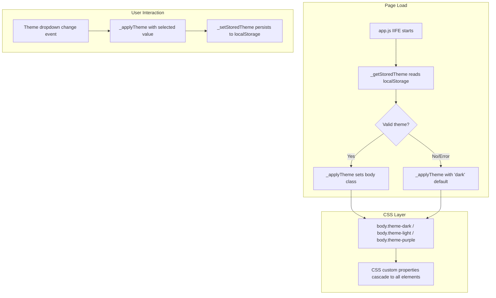

# Design Document: License Generator Themes & UI Refinements

## Overview

This design describes how to add multi-theme support (Dark, Light, Purple) to the License Generator PWA and refine the History tab UI. The approach uses CSS custom properties defined on body-level theme classes, a lightweight Theme Engine within the existing IIFE in `app.js`, a theme switcher dropdown in the Manage Apps tab, and History tab button/layout normalization.

The design preserves the zero-framework, single-file architecture. No build tools, no new files — all changes fit within the existing `styles.css`, `app.js`, and `index.html`.

## Architecture



### Design Decisions

1. **CSS Custom Properties over JS-applied inline styles**: Custom properties let the browser handle cascading and specificity. All existing hardcoded colors become `var(--color-*)` references, making theme switching a single class swap.

2. **Theme applied at IIFE start (synchronous)**: Since `app.js` is loaded at the end of `<body>`, applying the theme class immediately on script execution (before any DOM interaction) prevents a flash of unstyled/wrong-theme content.

3. **No separate theme.js file**: The theme engine is small (3 functions, ~30 lines). Keeping it in `app.js` avoids an extra HTTP request and keeps the service worker cache list unchanged.

4. **History tab inline delete button**: Adding a delete button directly on the collapsed row improves UX by reducing clicks for the most common destructive action, while the expanded view is simplified by removing the redundant Copy button (users can select+copy from the textarea).

## Components and Interfaces

### Theme Engine (in app.js)

```javascript
// --- Theme Engine ---
var THEME_KEY = 'license_gen_theme';
var VALID_THEMES = ['dark', 'light', 'purple'];
var DEFAULT_THEME = 'dark';

function _getStoredTheme() {
  try {
    var stored = localStorage.getItem(THEME_KEY);
    if (stored && VALID_THEMES.indexOf(stored) !== -1) {
      return stored;
    }
  } catch (e) { /* localStorage unavailable */ }
  return DEFAULT_THEME;
}

function _setStoredTheme(themeId) {
  try {
    localStorage.setItem(THEME_KEY, themeId);
  } catch (e) { /* fail silently */ }
}

function _applyTheme(themeId) {
  if (VALID_THEMES.indexOf(themeId) === -1) {
    themeId = DEFAULT_THEME;
  }
  document.body.classList.remove('theme-dark', 'theme-light', 'theme-purple');
  document.body.classList.add('theme-' + themeId);
  _setStoredTheme(themeId);

  // Update meta theme-color for mobile browsers
  var metaThemeColor = document.querySelector('meta[name="theme-color"]');
  if (metaThemeColor) {
    var bgColors = { dark: '#1e1e1e', light: '#f5f5f5', purple: '#1a0033' };
    metaThemeColor.setAttribute('content', bgColors[themeId]);
  }
}
```

### Theme Switcher HTML (in index.html, Manage Apps tab)

```html
<!-- Placed at top of panel-manage, before the first manage-section -->
<div class="manage-section">
    <h3 class="manage-subtitle">Theme</h3>
    <div class="form-group">
        <label for="theme-select">Appearance</label>
        <select id="theme-select">
            <option value="dark">Dark</option>
            <option value="light">Light</option>
            <option value="purple">Purple</option>
        </select>
    </div>
</div>
```

### Theme Switcher Event Handling (in app.js)

```javascript
// Theme switcher initialization
var themeSelect = document.getElementById('theme-select');
if (themeSelect) {
  themeSelect.value = _getStoredTheme();
  themeSelect.addEventListener('change', function() {
    _applyTheme(this.value);
  });
}

// Apply theme immediately on script load
_applyTheme(_getStoredTheme());
```

### History Tab Modifications

#### Inline Delete Button (in `_renderHistoryEntry`)

```javascript
function _renderHistoryEntry(entry, idx) {
  var entryDiv = document.createElement('div');
  entryDiv.className = 'history-entry collapsed';
  entryDiv.setAttribute('data-index', idx);

  var summary = document.createElement('div');
  summary.className = 'entry-summary';

  var userSpan = document.createElement('span');
  userSpan.className = 'entry-user';
  userSpan.textContent = entry.userName;

  var keySpan = document.createElement('span');
  keySpan.className = 'entry-key-preview';
  keySpan.textContent = _truncateKey(entry.licenseKey);

  var dateSpan = document.createElement('span');
  dateSpan.className = 'entry-date';
  dateSpan.textContent = _formatDate(entry.timestamp);

  // Inline delete button - visible in collapsed state
  var inlineDeleteBtn = document.createElement('button');
  inlineDeleteBtn.className = 'btn-inline-delete';
  inlineDeleteBtn.setAttribute('aria-label', 'Delete entry');
  inlineDeleteBtn.textContent = '🗑️';
  inlineDeleteBtn.addEventListener('click', function(e) {
    e.stopPropagation(); // Prevent expand/collapse toggle
    _deleteFromHistory(idx);
  });

  summary.appendChild(userSpan);
  summary.appendChild(keySpan);
  summary.appendChild(dateSpan);
  summary.appendChild(inlineDeleteBtn);
  entryDiv.appendChild(summary);

  entryDiv.addEventListener('click', function(e) {
    if (e.target.closest('.btn-inline-delete')) return;
    _toggleEntry(entryDiv);
  });

  return entryDiv;
}
```

#### Modified `_toggleEntry` (Copy button removed)

```javascript
function _toggleEntry(entryEl) {
  if (entryEl.classList.contains('collapsed')) {
    entryEl.classList.remove('collapsed');
    entryEl.classList.add('expanded');

    var details = document.createElement('div');
    details.className = 'entry-details';

    var textarea = document.createElement('textarea');
    textarea.className = 'entry-full-key';
    textarea.setAttribute('readonly', '');
    textarea.setAttribute('rows', '3');

    var idx = entryEl.getAttribute('data-index');
    var history = _loadHistory();
    var histIdx = parseInt(idx, 10);
    if (histIdx >= 0 && histIdx < history.length) {
      textarea.value = history[histIdx].licenseKey;
    }

    details.appendChild(textarea);

    var actions = document.createElement('div');
    actions.className = 'entry-actions';

    var deleteBtn = document.createElement('button');
    deleteBtn.className = 'btn-danger btn-small btn-delete';
    deleteBtn.textContent = '🗑️ Delete';
    deleteBtn.addEventListener('click', function() {
      _deleteFromHistory(idx);
    });

    actions.appendChild(deleteBtn);
    details.appendChild(actions);
    entryEl.appendChild(details);
  } else if (entryEl.classList.contains('expanded')) {
    entryEl.classList.remove('expanded');
    entryEl.classList.add('collapsed');

    var existingDetails = entryEl.querySelector('.entry-details');
    if (existingDetails) existingDetails.remove();
  }
}
```

## Data Models

### Theme Configuration (conceptual, no new data structure stored)

| Field | Type | Values | Storage |
|-------|------|--------|---------|
| theme identifier | string | `"dark"`, `"light"`, `"purple"` | localStorage key: `license_gen_theme` |

### CSS Custom Properties per Theme

| Property | Dark | Light | Purple |
|----------|------|-------|--------|
| `--color-bg` | #1e1e1e | #f5f5f5 | #1a0033 |
| `--color-surface` | #2d2d2d | #ffffff | #2d1b4e |
| `--color-text` | #e0e0e0 | #212121 | #f3e5f5 |
| `--color-text-secondary` | #9e9e9e | #616161 | #b39ddb |
| `--color-border` | #444444 | #e0e0e0 | #4a148c |
| `--color-accent` | #64b5f6 | #1976d2 | #ce93d8 |

### CSS Migration Strategy

All hardcoded color values in `styles.css` will be replaced with `var(--color-*)` references:

| Current Hardcoded Value | Replacement Variable | Usage |
|-------------------------|---------------------|-------|
| `#1e1e1e` (backgrounds) | `var(--color-bg)` | body background, input/textarea bg |
| `#2d2d2d` (cards/surfaces) | `var(--color-surface)` | .tab-panel, .tab-bar, .card backgrounds |
| `#e0e0e0` (primary text) | `var(--color-text)` | body color, .entry-user, .manage-subtitle |
| `#9e9e9e` (secondary text) | `var(--color-text-secondary)` | labels, .subtitle, .entry-key-preview, placeholder text, tab inactive |
| `#444` / `#444444` (borders) | `var(--color-border)` | input borders, section borders, .tab-bar border |
| `#64b5f6` (accent) | `var(--color-accent)` | .btn-primary bg, .title color, .tab.active, focus borders, links |
| `#333` (subtle borders) | `var(--color-border)` | .history-entry border (using same border var) |
| `#666` (muted text) | `var(--color-text-secondary)` | placeholder, .entry-date |

### CSS Custom Properties Definition (in styles.css)

```css
/* Theme Definitions */
body.theme-dark {
  --color-bg: #1e1e1e;
  --color-surface: #2d2d2d;
  --color-text: #e0e0e0;
  --color-text-secondary: #9e9e9e;
  --color-border: #444444;
  --color-accent: #64b5f6;
}

body.theme-light {
  --color-bg: #f5f5f5;
  --color-surface: #ffffff;
  --color-text: #212121;
  --color-text-secondary: #616161;
  --color-border: #e0e0e0;
  --color-accent: #1976d2;
}

body.theme-purple {
  --color-bg: #1a0033;
  --color-surface: #2d1b4e;
  --color-text: #f3e5f5;
  --color-text-secondary: #b39ddb;
  --color-border: #4a148c;
  --color-accent: #ce93d8;
}
```

### Service Worker Cache Version Bump Strategy

The service worker uses a `CACHE_NAME` constant for versioning. When CSS/JS files change:

1. Increment `CACHE_NAME` from `'license-generator-v2'` to `'license-generator-v3'`
2. The `activate` event handler already deletes old caches (any cache name ≠ current `CACHE_NAME`)
3. `skipWaiting()` ensures the new SW activates immediately
4. `clients.claim()` ensures active clients use the new cache

No structural changes to `sw.js` are needed — only the version string bump.

## Correctness Properties

*A property is a characteristic or behavior that should hold true across all valid executions of a system — essentially, a formal statement about what the system should do. Properties serve as the bridge between human-readable specifications and machine-verifiable correctness guarantees.*

### Property 1: Theme storage round-trip

*For any* valid theme identifier (one of "dark", "light", "purple"), calling `_setStoredTheme(themeId)` followed by `_getStoredTheme()` SHALL return the same theme identifier that was stored.

**Validates: Requirements 3.1**

### Property 2: Invalid theme identifier defaults to dark

*For any* string that is NOT one of the valid theme identifiers ("dark", "light", "purple"), calling `_applyTheme(invalidString)` SHALL result in the body having the class `theme-dark` and `_getStoredTheme()` returning "dark".

**Validates: Requirements 3.3**

### Property 3: History entry deletion reduces count by one

*For any* non-empty history array and any valid index within that array, calling `_deleteHistoryEntry(index)` SHALL result in the history array length being exactly one less than before, and the deleted entry SHALL no longer be present in the array.

**Validates: Requirements 6.3**

## Error Handling

| Scenario | Handling |
|----------|----------|
| localStorage unavailable (private browsing, quota) | Theme engine catches errors silently, defaults to dark theme. No user-facing error. |
| Invalid/corrupted theme value in localStorage | `_getStoredTheme()` returns `DEFAULT_THEME` ("dark"). `_applyTheme()` validates input against `VALID_THEMES` array. |
| Missing `theme-select` element in DOM | Null check before adding event listener (`if (themeSelect) { ... }`). Theme still applies from localStorage. |
| History entry deletion with invalid index | `_deleteHistoryEntry()` already checks bounds (`if (index < 0 || index >= history.length) return false`). |
| Event propagation on inline delete | `e.stopPropagation()` prevents the click from reaching the row's expand/collapse handler. |

## Testing Strategy

### Unit Tests (Example-Based)

Unit tests cover specific behaviors with concrete values:

- **Theme definitions**: Verify each theme class sets all 6 CSS custom properties to expected hex values
- **Theme switcher presence**: Verify dropdown exists in Manage Apps tab at the correct position
- **Dropdown sync**: After applying each theme, verify dropdown `value` matches
- **WCAG contrast**: Compute contrast ratio for each theme's text/bg combination, assert ≥ 4.5:1
- **History expanded state**: Expand an entry and verify exactly 2 interactive elements (textarea + Delete button), no Copy button
- **Inline delete button presence**: Verify 🗑️ button exists in collapsed entry row
- **Inline delete event isolation**: Click inline delete, verify entry does not toggle expand/collapse
- **Button normalization**: Verify no history action button has `width: 100%` or `display: block`

### Property-Based Tests

Property tests verify universal properties across generated inputs. Use **fast-check** (JavaScript property-based testing library).

Configuration:
- Minimum 100 iterations per property test
- Each test tagged with feature and property reference

| Property | Generator | Assertion |
|----------|-----------|-----------|
| Property 1: Theme round-trip | `fc.constantFrom('dark', 'light', 'purple')` | `_setStoredTheme(t); assert(_getStoredTheme() === t)` |
| Property 2: Invalid defaults to dark | `fc.string().filter(s => !['dark','light','purple'].includes(s))` | After `_applyTheme(s)`, body has `theme-dark` class |
| Property 3: Delete reduces count | `fc.array(fc.record({...}), {minLength:1})` + `fc.nat()` constrained to valid index | After delete, `history.length === original - 1` and entry absent |

Tag format: `// Feature: license-gen-themes-ui, Property {N}: {title}`

### Integration Tests

- **Page load theme restoration**: Load page with localStorage containing each valid theme, verify correct body class before any user interaction
- **Service worker cache update**: After version bump, verify old cache is deleted on activate
