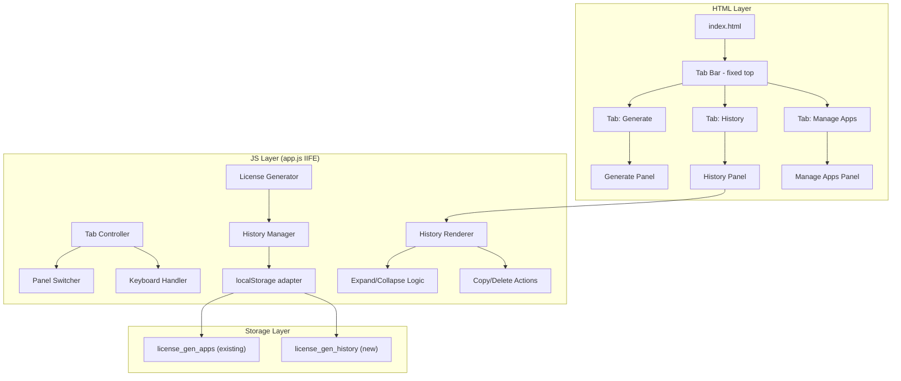

# Design Document: License History Tabs

## Overview

This feature transforms the License Generator PWA from a vertically-stacked two-card layout into a tab-based single-page interface with three panels: **Generate**, **History**, and **Manage Apps**. A new License History system stores every generated key in localStorage and provides grouped-by-app viewing, expand/collapse details, copy-to-clipboard, and delete operations.

The design preserves the existing vanilla HTML/CSS/JS IIFE architecture with no build tools or frameworks, maintaining the dark theme (#1e1e1e, #2d2d2d, #64b5f6) and mobile-first PWA approach.

## Architecture



**Key Architectural Decisions:**

1. **Single file approach**: All new JS logic remains in `app.js` within the existing IIFE. No new JS files are introduced, keeping the PWA simple and the service worker cache list minimal.
2. **Progressive enhancement**: Tab navigation degrades gracefully — if JS fails, the first panel (Generate) is visible by default via CSS.
3. **Separation of concerns within IIFE**: Tab controller, history manager, and history renderer are implemented as distinct function groups within the IIFE, communicating through direct function calls (no event bus needed for this complexity level).

## Components and Interfaces

### 1. Tab Navigation Component

**HTML Structure:**
```html
<div class="tab-bar" role="tablist" aria-label="Main Navigation">
  <button class="tab active" role="tab" id="tab-generate" 
          aria-selected="true" aria-controls="panel-generate" tabindex="0">
    Generate
  </button>
  <button class="tab" role="tab" id="tab-history" 
          aria-selected="false" aria-controls="panel-history" tabindex="-1">
    History
  </button>
  <button class="tab" role="tab" id="tab-manage" 
          aria-selected="false" aria-controls="panel-manage" tabindex="-1">
    Manage Apps
  </button>
</div>

<div class="tab-panels">
  <div class="tab-panel active" role="tabpanel" id="panel-generate" aria-labelledby="tab-generate">
    <!-- existing Generate card content (unwrapped from .card) -->
  </div>
  <div class="tab-panel" role="tabpanel" id="panel-history" aria-labelledby="tab-history" hidden>
    <!-- History panel content -->
  </div>
  <div class="tab-panel" role="tabpanel" id="panel-manage" aria-labelledby="tab-manage" hidden>
    <!-- existing Manage Apps card content (unwrapped from .card) -->
  </div>
</div>
```

**CSS for Tab Bar:**
```css
.tab-bar {
  position: fixed;
  top: 0;
  left: 0;
  right: 0;
  z-index: 100;
  display: flex;
  background-color: #2d2d2d;
  border-bottom: 1px solid #444;
}

.tab {
  flex: 1;
  min-height: 44px;
  min-width: 44px;
  padding: 12px 8px;
  border: none;
  border-bottom: 3px solid transparent;
  background: transparent;
  color: #9e9e9e;
  font-size: 0.875rem;
  font-weight: 600;
  cursor: pointer;
  text-overflow: ellipsis;
  overflow: hidden;
  white-space: nowrap;
  transition: color 0.2s, border-color 0.2s;
}

.tab.active {
  color: #64b5f6;
  border-bottom-color: #64b5f6;
}

.tab:focus-visible {
  outline: 2px solid #64b5f6;
  outline-offset: -2px;
}
```

**JS Tab Controller Interface:**
```javascript
// Internal functions within the IIFE:
function _switchTab(tabId)       // Activates tab, shows panel, hides others
function _handleTabKeydown(e)    // Arrow key navigation + Enter/Space activation
function _initTabs()             // Sets up event listeners on tab buttons
```

**Switching Logic:**
- `_switchTab(tabId)` sets `aria-selected="true"` and adds `.active` class on the target tab, removes from all others.
- Sets `tabindex="0"` on active tab, `tabindex="-1"` on inactive tabs.
- Shows corresponding panel (removes `hidden`), hides others (adds `hidden`).
- If switching to History tab, calls `_renderHistory()` to refresh the display.

**Keyboard Navigation:**
- Left/Right arrow keys move focus to previous/next tab (wrapping at edges).
- Enter or Space activates the currently focused tab.
- Follows WAI-ARIA Tabs pattern.

### 2. History Manager

**Interface:**
```javascript
function _loadHistory()                    // Returns: Array<HistoryEntry>
function _saveHistory(history)             // Persists array to localStorage
function _addHistoryEntry(appName, userName, licenseKey)  // Creates and appends entry
function _deleteHistoryEntry(index)        // Removes entry at index
function _clearAppHistory(appName)         // Removes all entries for an app
function _getGroupedHistory()              // Returns: { [appName]: HistoryEntry[] } sorted
```

**Key Behaviors:**
- `_addHistoryEntry` enforces the 500-entry cap by removing the oldest entry (earliest timestamp) before appending when at capacity.
- `_addHistoryEntry` creates an ISO 8601 UTC timestamp via `new Date().toISOString()`.
- All write operations call `_saveHistory` which wraps `localStorage.setItem` in try/catch. On failure, it returns `false` and the caller shows an error toast.
- `_getGroupedHistory` groups entries by `appName`, sorts groups alphabetically (case-insensitive), and sorts entries within each group by timestamp descending (newest first).

### 3. History Renderer

**Interface:**
```javascript
function _renderHistory()                  // Builds full history panel DOM
function _renderAppGroup(appName, entries) // Renders a single app group
function _renderHistoryEntry(entry, idx)   // Renders a single entry row
function _toggleEntry(entryEl)             // Expand/collapse an entry
function _copyFromHistory(licenseKey, btn) // Copies key, shows feedback
function _deleteFromHistory(index)         // Confirm + delete + re-render
function _clearAllForApp(appName)          // Confirm + clear + re-render
```

**History Entry DOM (collapsed):**
```html
<div class="history-entry collapsed" data-index="3">
  <div class="entry-summary">
    <span class="entry-user">John Doe</span>
    <span class="entry-key-preview">eyJuIjoiSm9obiIsImg…</span>
    <span class="entry-date">15 Jun 2025</span>
  </div>
</div>
```

**History Entry DOM (expanded):**
```html
<div class="history-entry expanded" data-index="3">
  <div class="entry-summary">
    <span class="entry-user">John Doe</span>
    <span class="entry-key-preview">eyJuIjoiSm9obiIsImg…</span>
    <span class="entry-date">15 Jun 2025</span>
  </div>
  <div class="entry-details">
    <textarea class="entry-full-key" readonly rows="3">eyJuIjoiSm9obiIsImgiOiJhYmMxMjM...</textarea>
    <div class="entry-actions">
      <button class="btn-secondary btn-small btn-copy">📋 Copy</button>
      <button class="btn-danger btn-small btn-delete">🗑️ Delete</button>
    </div>
  </div>
</div>
```

**Empty State:**
```html
<div class="history-empty">
  <p>No licenses have been generated yet.</p>
  <p class="history-empty-hint">Generate a license from the "Generate" tab to see it here.</p>
</div>
```

### 4. Content Migration

The existing `.card` wrappers are removed. Their content moves directly into `<div class="tab-panel">` containers:

| Current Structure | New Structure |
|---|---|
| `<div class="card">` (Generate) | `<div class="tab-panel" id="panel-generate">` |
| `<div class="card manage-card">` (Manage) | `<div class="tab-panel" id="panel-manage">` |

The panel containers inherit the card styling (padding, background, border-radius) via `.tab-panel` CSS class, preserving the visual appearance within each panel.

### 5. Integration with Existing Generate Flow

After `generateLicense()` succeeds and the key is displayed, the existing flow is extended with one additional call:

```javascript
// In generate button click handler, after setting licenseOutput.value:
var saved = _addHistoryEntry(selectedApp.name, name, key);
if (!saved) {
  _showToast('⚠️ History entry could not be saved.', 'error');
}
```

This ensures the history is populated without modifying the existing license generation logic.

## Data Models

### History Entry Schema

```javascript
{
  "appName": "Pay Up Partners",    // String - application name from registry
  "userName": "John Doe",          // String - licensee name
  "licenseKey": "eyJuIjoiSm9o...", // String - full base64 license key
  "timestamp": "2025-06-27T10:30:00.000Z"  // String - ISO 8601 UTC
}
```

### localStorage Structure

| Key | Type | Description |
|---|---|---|
| `license_gen_apps` | `Array<{name, secret}>` | Existing app registry (unchanged) |
| `license_gen_history` | `Array<HistoryEntry>` | New history array, max 500 entries |

### Date Formatting

Display format for history entries: `DD MMM YYYY` (e.g., "15 Jun 2025")

Conversion function:
```javascript
function _formatDate(isoString) {
  var d = new Date(isoString);
  var months = ['Jan','Feb','Mar','Apr','May','Jun','Jul','Aug','Sep','Oct','Nov','Dec'];
  var day = String(d.getDate()).padStart(2, '0');
  return day + ' ' + months[d.getMonth()] + ' ' + d.getFullYear();
}
```

### Key Truncation

Preview format: first 20 characters + "…"

```javascript
function _truncateKey(key) {
  if (key.length <= 20) return key;
  return key.substring(0, 20) + '…';
}
```

## Correctness Properties

*A property is a characteristic or behavior that should hold true across all valid executions of a system — essentially, a formal statement about what the system should do. Properties serve as the bridge between human-readable specifications and machine-verifiable correctness guarantees.*

### Property 1: Tab Activation Invariant

*For any* sequence of tab activations (via click, tap, or keyboard), exactly one tab panel SHALL be visible at any time, and the visible panel SHALL correspond to the tab with `aria-selected="true"` and the `.active` CSS class applied (with accent color #64b5f6 text and bottom border).

**Validates: Requirements 1.2, 1.3**

### Property 2: Keyboard Navigation Correctness

*For any* focused tab position and arrow key press (Left or Right), the focus SHALL move to the adjacent tab (wrapping from first to last and last to first), and pressing Enter or Space on any focused tab SHALL activate that tab (equivalent to a click).

**Validates: Requirements 1.6**

### Property 3: History Entry Completeness

*For any* valid app name and user name combination used to generate a license, the resulting History_Entry in localStorage SHALL contain all four fields (appName matching the selected registry entry, userName matching the input, licenseKey matching the generated output, and timestamp as a valid ISO 8601 UTC string).

**Validates: Requirements 2.1, 2.4**

### Property 4: History Capacity Invariant

*For any* history array state, the total number of History_Entry records SHALL never exceed 500. When the array is at capacity (500) and a new entry is added, the entry with the earliest timestamp SHALL be removed before the new entry is appended, resulting in exactly 500 entries.

**Validates: Requirements 2.6**

### Property 5: History Grouping Alphabetical Order

*For any* set of History_Entry records with varying application names, the grouped display SHALL present application groups in case-insensitive alphabetical order by app name.

**Validates: Requirements 3.1**

### Property 6: History Entry Display Format

*For any* History_Entry, the collapsed display SHALL show the user name unmodified, the license key truncated to exactly the first 20 characters followed by "…" (or the full key if it is 20 characters or fewer), and the date formatted as "DD MMM YYYY" derived from the ISO 8601 timestamp.

**Validates: Requirements 3.2**

### Property 7: Reverse Chronological Order Within Groups

*For any* application group containing multiple History_Entry records, the entries SHALL be ordered by timestamp descending (newest first), such that for any two adjacent entries, the first entry's timestamp is greater than or equal to the second's.

**Validates: Requirements 3.4**

### Property 8: Expand/Collapse Toggle Round-Trip

*For any* History_Entry in collapsed state, tapping it SHALL expand it to reveal the full license key and action buttons. Subsequently tapping it again SHALL collapse it back to the truncated preview state, restoring the original display.

**Validates: Requirements 3.5, 3.6**

### Property 9: Deletion Removes Entry from Storage

*For any* History_Entry that exists in localStorage, confirming its deletion (single or Clear All for its app group) SHALL result in that entry no longer being present in the localStorage "license_gen_history" array, and the displayed list SHALL reflect the removal without the entry being visible.

**Validates: Requirements 4.3, 4.7**

### Property 10: Copy Places Exact Key on Clipboard

*For any* expanded History_Entry, tapping the Copy button SHALL place the exact full `licenseKey` string (byte-for-byte identical) onto the system clipboard via the Clipboard API.

**Validates: Requirements 5.2**

## Error Handling

| Scenario | Handling |
|---|---|
| `localStorage.setItem` throws on history save | Show toast "⚠️ History entry could not be saved." License key still displayed to user. `_addHistoryEntry` returns `false`. |
| `localStorage.getItem` returns corrupted JSON for history | Catch parse error, initialize history as empty array `[]`, log warning to console. |
| Clipboard API unavailable or `writeText` rejects | Show inline error "Copy failed" near the button. No success confirmation shown. |
| History array exceeds 500 on load (corrupted state) | Trim to 500 entries (keep newest 500 by sorting on timestamp desc, slicing first 500). |
| App from history no longer in registry | Still display the history entry — `appName` is a plain string, not a foreign key reference. |
| Tab panel referenced by `aria-controls` missing in DOM | `_switchTab` silently does nothing if target panel not found (defensive guard). |

**Toast Notification Pattern:**
```javascript
function _showToast(message, type) {
  // type: 'success' | 'error'
  // Creates a temporary element, auto-dismisses after 2-3 seconds
  var toast = document.createElement('div');
  toast.className = 'toast toast-' + type;
  toast.textContent = message;
  document.body.appendChild(toast);
  setTimeout(function() { toast.remove(); }, type === 'error' ? 3000 : 2000);
}
```

## Testing Strategy

### Unit Tests (Example-Based)

| Test | Validates |
|---|---|
| Tab order in DOM matches "Generate", "History", "Manage Apps" | Req 1.1 |
| Default active tab is "Generate" on load | Req 1.4 |
| Tab bar has `position: fixed` or `position: sticky` at top | Req 1.5 |
| History stored under key "license_gen_history" | Req 2.2 |
| localStorage error shows error toast but license key remains | Req 2.5 |
| Empty history shows "no licenses generated" message | Req 3.3 |
| Delete confirmation dialog appears on Delete tap | Req 4.2 |
| Cancel on Delete leaves entry unchanged | Req 4.4 |
| Clear All button present for each app group | Req 4.5 |
| Clear All confirmation dialog appears | Req 4.6 |
| Cancel on Clear All leaves entries unchanged | Req 4.8 |
| Successful copy shows "Copied!" message that auto-dismisses | Req 5.3 |
| Clipboard failure shows error message | Req 5.4 |
| Tabs fit in single row at 320px viewport | Req 6.1 |
| Tab tap targets are min 44px × 44px | Req 6.2 |
| Full-width layout at ≤500px viewport | Req 6.3 |
| Max-width 500px centered at >500px viewport | Req 6.4 |

### Property-Based Tests

Property-based tests SHALL use **fast-check** (JavaScript PBT library) with a minimum of **100 iterations** per property test.

Each property test is tagged with:
```
Feature: license-history-tabs, Property {N}: {title}
```

| Property | What Varies | Key Generators |
|---|---|---|
| 1: Tab Activation Invariant | Random sequences of tab IDs | `fc.array(fc.constantFrom('generate','history','manage'))` |
| 2: Keyboard Navigation | Starting tab index + key sequences | `fc.nat({max:2})`, `fc.array(fc.constantFrom('ArrowLeft','ArrowRight','Enter','Space'))` |
| 3: History Entry Completeness | App names + user names | `fc.string({minLength:1})` for both |
| 4: History Capacity Invariant | History arrays of varying sizes (0–505) | `fc.array(historyEntryArb, {maxLength:505})` |
| 5: Grouping Alphabetical Order | Sets of entries with random app names | `fc.array(historyEntryArb, {minLength:2})` |
| 6: Entry Display Format | Random keys (varying lengths), random dates | `fc.string()`, `fc.date()` |
| 7: Reverse Chronological Order | Entries with random timestamps | `fc.array(fc.date())` within a group |
| 8: Expand/Collapse Toggle | Any entry index in any history | `fc.nat()` mapped to valid indices |
| 9: Deletion Removes Entry | Any entry index or app name | `fc.nat()`, `fc.string()` |
| 10: Copy Exact Key | Random license key strings | `fc.base64String({minLength:20})` |

### Service Worker Cache Update

The service worker cache version must be bumped from `license-generator-v1` to `license-generator-v2` to ensure returning users receive the updated HTML/CSS/JS. The `FILES_TO_CACHE` array remains the same (no new files added). The existing activate handler already cleans up old caches.

### Manual Testing Checklist

- [ ] Tab switching animates smoothly on iOS Safari
- [ ] History panel scrolls independently when many entries exist
- [ ] PWA install prompt still works after layout change
- [ ] Offline mode still serves the app correctly (cache-first)
- [ ] No visual overflow on 320px viewport width
